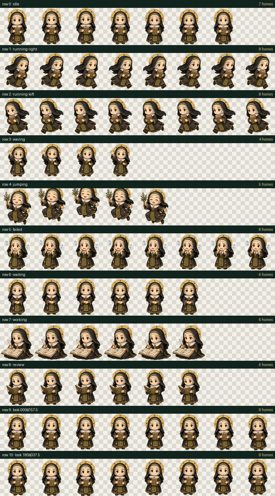

# Hildegard Codex Pet · 小希尔德加德桌宠

[中文](#中文) · [English](#english)



<p align="center">
  
</p>

## 中文

小希尔德加德是一只非官方 Codex 桌宠。她身着本笃会服饰，携带手抄本、羽毛笔与药草，会根据工作、等待、审阅、运行、失败和视线方向切换动作。视觉设计借鉴罗曼式手抄本的色彩气质，角色与动画素材均为本项目原创生成和整理。

### 图集规格

- Codex v2 pet atlas
- RGBA WebP
- 1536 × 2288 像素
- 8 列 × 11 行
- 单格 192 × 208 像素
- 9 行活动状态与 2 行视线方向

### 安装

macOS 或 Linux：

```bash
./scripts/install.sh
```

Windows PowerShell：

```powershell
powershell -ExecutionPolicy Bypass -File .\scripts\install.ps1
```

手动安装：

```bash
mkdir -p "${CODEX_HOME:-$HOME/.codex}/pets/hildegard"
cp package/pet.json package/spritesheet.webp \
  "${CODEX_HOME:-$HOME/.codex}/pets/hildegard/"
```

安装后若未立即出现在桌宠列表，请刷新或重启 Codex。

### 本地重建与验证

```bash
python3 -m pip install -r requirements.txt
python3 scripts/build_assets.py
python3 scripts/validate.py
```

### 项目内容

- `package/pet.json`：安装配置。
- `package/spritesheet.webp`：Codex v2 动画图集。
- `source/`：图像生成母版与透明处理版本。
- `assets/contact-sheet.png`：完整状态预览。
- `assets/look-directions.png`：视线方向检查图。
- `assets/idle.gif`：待机动画预览。
- `qa/`：生成提示词、构建报告与验证报告。
- `scripts/`：构建、验证、安装与卸载脚本。

## English

Hildegard is an unofficial Codex pet inspired by the historical figure Hildegard von Bingen. She carries an illuminated manuscript, writes musical notation, gathers herbs, and reacts to working, waiting, reviewing, running, failure, and look-direction states. The original character design combines a Benedictine habit with a restrained Romanesque manuscript palette.

### Atlas specification

- Codex v2 pet atlas
- RGBA WebP
- 1536 × 2288 pixels
- 8 columns × 11 rows
- 192 × 208 pixels per cell
- 9 activity rows plus 2 look-direction rows

### Install

macOS or Linux:

```bash
./scripts/install.sh
```

Windows PowerShell:

```powershell
powershell -ExecutionPolicy Bypass -File .\scripts\install.ps1
```

Refresh or restart Codex if Hildegard does not appear immediately.

### Rebuild and validate

```bash
python3 -m pip install -r requirements.txt
python3 scripts/build_assets.py
python3 scripts/validate.py
```

The repository keeps the source pose sheet, deterministic atlas builder, previews, install-ready package, and machine-readable QA reports. GitHub Actions rebuilds the assets and rejects changes that do not reproduce the committed package.

## Attribution and status

This is an unofficial custom pet for Codex and is not affiliated with or endorsed by OpenAI. Hildegard von Bingen is a historical figure; this project uses an original stylized interpretation rather than copying a specific portrait.
